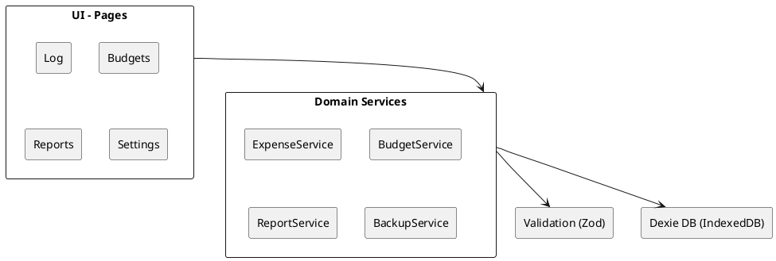
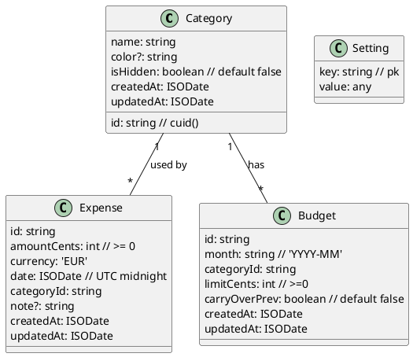
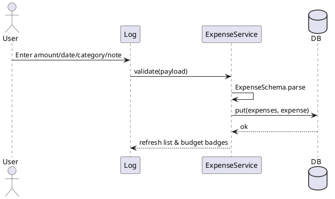
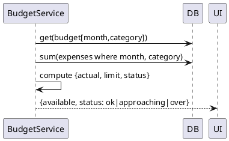

# SPEC-1—Išlaidų sekimo aplikacijos architektūra

## Background

Šio projekto tikslas — sukurti paprastą, vietiniu režimu veikiančią (local‑first) darbastalio žiniatinklio aplikaciją, skirtą rankiniam išlaidų fiksavimui, mėnesinių biudžetų per kategorijas valdymui ir aiškioms ataskaitoms (diagramoms). Sprendimas orientuotas į vieno naudotojo scenarijų be paskyrų — visi duomenys saugomi kliento naršyklėje (IndexedDB). Pagrindinis naudojimo atvejis: greitas įrašas „suma, data, kategorija, pastaba“, aiškus biudžeto likutis ir paprastas atsarginės kopijos eksportas/importas JSON formatu. Tikslinė auditorija — ES gyventojai, kuriems patogu naudoti EUR ir kurie nori paprasto, be banko integracijų, kasdienio išlaidų stebėjimo.

## Requirements

**MoSCoW**

**Must have**
- English UI; EUR currency; single-user, no accounts; all data local (IndexedDB). fileciteturn1file1L4-L6 fileciteturn1file1L25-L27
- Pages: Log, Budgets, Reports, Settings. fileciteturn1file0L3-L7
- Expense entry with amount, date, category, note; keyboard-first flow; undo last change. fileciteturn1file1L17-L19 fileciteturn1file1L29-L30
- Monthly budgets per category; optional carry-over; alerts at ~80% and over-budget. fileciteturn1file1L19-L24
- Reports: Budget vs Actual (current month), Spend by Category (pie), Trend Over Time (monthly line). fileciteturn1file1L21-L24
- Data operations: Export/Import JSON; Clear data; autosave. fileciteturn1file3L10-L10 fileciteturn1file1L58-L62 fileciteturn1file2L39-L41
- Quick filters: month picker, category filter, text search in notes. fileciteturn1file1L28-L29
- Input validation (amount/date), XSS-safe rendering of notes. fileciteturn1file1L61-L62

**Should have**
- Preset category list with CRUD (add/edit/hide); helpful defaults (current month auto-selected). fileciteturn1file1L18-L19 fileciteturn1file2L18-L18
- Clear, plain-English copy and empty states; simple onboarding. fileciteturn1file1L50-L56 fileciteturn1file2L28-L29
- Consistent, accessible charts (Chart.js) and responsive desktop-first layout. fileciteturn1file1L35-L37

**Could have**
- Hotkeys for quick add; pinned categories; performance polish. fileciteturn1file2L30-L33
- Desktop notifications for nearing limits; goals; anonymized insights. fileciteturn1file2L45-L49

**Won’t have (MVP)**
- Accounts/cloud sync; bank connections; mobile layout; multi-currency UI. fileciteturn1file2L33-L36


## Method

### Tech Stack
- **Frontend:** React + TypeScript, Vite build, Desktop‑first responsive UI.
- **State & Forms:** React state + lightweight hooks; validation via Zod; tables via TanStack Table.
- **Charts:** Chart.js (pie/line/bar) with simple adapters.
- **Storage:** IndexedDB per‑browser instance, wrapped with Dexie. JSON import/export.
- **Packaging:** PWA manifest & offline cache for instant startup (optional for MVP).

### High‑Level Architecture


### Data Model (IndexedDB via Dexie)


**Dexie schema**
```ts
// db.ts
export const db = new Dexie('expense-tracker');
db.version(1).stores({
  categories: 'id, name, isHidden, createdAt, updatedAt',
  expenses: 'id, date, categoryId, createdAt, updatedAt',
  budgets: 'id, month, categoryId, createdAt, updatedAt',
  settings: 'key'
});
```

### Domain Rules & Algorithms
- **Money:** store as integer `amountCents` (EUR). Format on render.
- **Dates:** persist as UTC ISO; filter by month using `YYYY-MM` derived key.
- **Budget status** (per category, per month):
  - `actual = sum(expenses.amountCents where month & category)`
  - `limit = budget.limitCents`
  - `carryIn = previousMonthUnspent if budget.carryOverPrev`
  - `available = limit + carryIn - actual`
  - **Alert levels:** `approaching` when `actual/limit >= 0.8` and `< 1.0`; `over` when `actual >= limit`.
- **Carry‑over computation:**
  - `previousMonthUnspent = max(limitPrev - actualPrev, 0)` only if previous month had a budget and `carryOverPrev` enabled.
- **Undo last change:** maintain an in‑memory stack of last operations (create/update/delete) with inverse patches; pop to revert.
- **Validation:** all create/update inputs go through Zod schemas; sanitize `note` when rendering (escape HTML) and limit to 500 chars.
- **Soft‑delete:** not required for MVP; immediate delete with confirmation.


### Zod Schemas (extract)
```ts
const Money = z.number().int().nonnegative();
const ISODate = z.string().datetime({ offset: true });
export const CategorySchema = z.object({
  id: z.string(),
  name: z.string().min(1).max(40),
  color: z.string().regex(/^#?[0-9a-fA-F]{6}$/).optional(),
  isHidden: z.boolean().default(false),
  createdAt: ISODate, updatedAt: ISODate,
});
export const ExpenseSchema = z.object({
  id: z.string(), amountCents: Money, currency: z.literal('EUR'),
  date: ISODate, categoryId: z.string(), note: z.string().max(500).optional(),
  createdAt: ISODate, updatedAt: ISODate,
});
export const BudgetSchema = z.object({
  id: z.string(), month: z.string().regex(/^\d{4}-\d{2}$/),
  categoryId: z.string(), limitCents: Money, carryOverPrev: z.boolean().default(false),
  createdAt: ISODate, updatedAt: ISODate,
});
```


### Core Use‑case Flows
**Add expense**


**Budget badge calculation (per category)**


### UI Outline (Desktop‑first)
- **Log:** fast add form (amount first), table with month/category filters, inline edit, keyboard shortcuts (↑↓ to navigate, `e` edit, `del` delete), running total.
- **Budgets:** grid by category with inputs for monthly limit and toggle **Carry over**; badge shows available/used and status.
- **Reports:**
  - *Budget vs Actual* (bar), *Spend by Category* (pie), *Trend Over Time* (line for last 12 months).
- **Settings:** backup/restore, manage categories (CRUD & hide), clear data.

### Backup Format (single file `backup.json`)
```json
{
  "version": 1,
  "exportedAt": "2025-09-28T10:00:00.000Z",
  "categories": [ { "id": "cat_x", "name": "Groceries", "isHidden": false, "createdAt": "...", "updatedAt": "..." } ],
  "budgets": [ { "id": "b1", "month": "2025-09", "categoryId": "cat_x", "limitCents": 25000, "carryOverPrev": false, "createdAt": "...", "updatedAt": "..." } ],
  "expenses": [ { "id": "e1", "amountCents": 1234, "currency": "EUR", "date": "2025-09-27T00:00:00.000Z", "categoryId": "cat_x", "note": "milk", "createdAt": "...", "updatedAt": "..." } ],
  "settings": [ { "key": "ui.theme", "value": "light" } ]
}
```

### Non‑functional
- **Performance:** all list views virtualized after 1k rows; IndexedDB queries indexed by `date`, `categoryId`.
- **Accessibility:** keyboard‑first, focus management, ARIA labels on charts.
- **Security:** no external network; escape notes on render; content‑security‑policy for PWA (when enabled).


## Implementation

### 0) Prerequisites
- Node.js ≥ 20, pnpm ≥ 9 (arba npm/yarn).
- Modern Chromium‑based naršyklė (IndexedDB + PWA support).

### 1) Project scaffolding
```bash
pnpm create vite expense-tracker --template react-ts
cd expense-tracker
pnpm add dexie dexie-react-hooks zod chart.js react-chartjs-2 @tanstack/react-table date-fns @paralleldrive/cuid2
pnpm add -D eslint @typescript-eslint/eslint-plugin @typescript-eslint/parser
```

### 2) Project structure
```
src/
  app/
    App.tsx
    routes.tsx
    theme.css
  db/
    db.ts
    seeds.ts
  domain/
    schemas.ts
    types.ts
    budget.ts
  services/
    expense.ts
    budget.ts
    report.ts
    backup.ts
    category.ts
  hooks/
    useBudgetBadges.ts
  pages/
    Log/
      LogPage.tsx
      LogTable.tsx
      QuickAddForm.tsx
    Budgets/
      BudgetsPage.tsx
    Reports/
      ReportsPage.tsx
    Settings/
      SettingsPage.tsx
  components/
    Layout.tsx
    Money.tsx
    MonthPicker.tsx
    ConfirmDialog.tsx
  utils/
    dates.ts
    money.ts
  tests/
    budget.spec.ts
main.tsx
vite-env.d.ts
```


### 3) Database (Dexie)
`src/db/db.ts`
```ts
import Dexie, { Table } from 'dexie';
export interface Category { id: string; name: string; color?: string; isHidden: boolean; createdAt: string; updatedAt: string; }
export interface Expense { id: string; amountCents: number; currency: 'EUR'; date: string; categoryId: string; note?: string; createdAt: string; updatedAt: string; }
export interface Budget { id: string; month: string; categoryId: string; limitCents: number; carryOverPrev: boolean; createdAt: string; updatedAt: string; }
export interface Setting { key: string; value: unknown }
export class ExpenseDB extends Dexie {
  categories!: Table<Category, string>;
  expenses!: Table<Expense, string>;
  budgets!: Table<Budget, string>;
  settings!: Table<Setting, string>;
  constructor() {
    super('expense-tracker');
    this.version(1).stores({
      categories: 'id, name, isHidden, createdAt, updatedAt',
      expenses: 'id, date, categoryId, createdAt, updatedAt',
      budgets: 'id, month, categoryId, createdAt, updatedAt',
      settings: 'key'
    });
  }
}
export const db = new ExpenseDB();
```

`src/db/seeds.ts`
```ts
import { db } from './db';
import { createId } from '@paralleldrive/cuid2';
const now = () => new Date().toISOString();
export async function seedIfEmpty() {
  const count = await db.categories.count();
  if (count > 0) return;
  const base = ['Groceries','Transport','Eating Out','Utilities','Rent','Entertainment','Health','Other'];
  await db.transaction('rw', db.categories, async () => {
    for (const name of base) {
      await db.categories.add({ id: createId(), name, isHidden:false, createdAt: now(), updatedAt: now() });
    }
  });
}
```


### 4) Domain schemas (Zod) ir tipai
`src/domain/schemas.ts`
```ts
import { z } from 'zod';
export const Money = z.number().int().nonnegative();
export const ISODate = z.string().datetime({ offset: true });
export const CategorySchema = z.object({ id: z.string(), name: z.string().min(1).max(40), color: z.string().regex(/^#?[0-9a-fA-F]{6}$/).optional(), isHidden: z.boolean().default(false), createdAt: ISODate, updatedAt: ISODate });
export const ExpenseSchema = z.object({ id: z.string(), amountCents: Money, currency: z.literal('EUR'), date: ISODate, categoryId: z.string(), note: z.string().max(500).optional(), createdAt: ISODate, updatedAt: ISODate });
export const BudgetSchema = z.object({ id: z.string(), month: z.string().regex(/^\d{4}-\d{2}$/), categoryId: z.string(), limitCents: Money, carryOverPrev: z.boolean().default(false), createdAt: ISODate, updatedAt: ISODate });
export type Category = z.infer<typeof CategorySchema>;
export type Expense = z.infer<typeof ExpenseSchema>;
export type Budget = z.infer<typeof BudgetSchema>;
```


### 5) Budget matematikos modulis
`src/domain/budget.ts`
```ts
export type BudgetCalc = { actual: number; limit: number; carryIn: number; available: number; status: 'ok'|'approaching'|'over' };
export function computeStatus(actual:number, limit:number): BudgetCalc['status'] {
  if (limit <= 0) return 'over';
  const ratio = actual/limit;
  if (ratio >= 1) return 'over';
  if (ratio >= 0.8) return 'approaching';
  return 'ok';
}
export function calcBudget(actual:number, limit:number, carryIn:number=0): BudgetCalc {
  const available = limit + carryIn - actual;
  return { actual, limit, carryIn, available, status: computeStatus(actual, limit) };
}
```


### 6) Services (CRUD + queries)
`src/services/expense.ts`
```ts
import { db } from '../db/db';
import { ExpenseSchema, type Expense } from '../domain/schemas';
export async function addExpense(e: Expense) { ExpenseSchema.parse(e); await db.expenses.put(e); }
export async function listExpensesByMonth(ym: string) { return db.expenses.where('date').between(`${ym}-01`, `${ym}-99`).toArray(); }
export async function deleteExpense(id: string) { await db.expenses.delete(id); }
```

`src/services/budget.ts`
```ts
import { db } from '../db/db';
import { calcBudget } from '../domain/budget';
export async function getBudgetBadge(ym: string, categoryId: string) {
  const [b] = await db.budgets.where({ month: ym, categoryId }).toArray();
  const limit = b?.limitCents ?? 0; const carry = b?.carryOverPrev ? await carryIn(ym, categoryId) : 0;
  const actual = await sumActual(ym, categoryId);
  return calcBudget(actual, limit, carry);
}
async function sumActual(ym:string, categoryId:string) {
  const rows = await db.expenses.where('date').between(`${ym}-01`,`${ym}-99`).and(e=>e.categoryId===categoryId).toArray();
  return rows.reduce((s,e)=>s+e.amountCents,0);
}
async function carryIn(ym:string, categoryId:string) {
  const [y,m] = ym.split('-').map(Number); const prev = `${m===1?y-1:y}-${m===1?12:(m-1).toString().padStart(2,'0')}`;
  const [bPrev] = await db.budgets.where({ month: prev, categoryId }).toArray();
  if (!bPrev) return 0; const actualPrev = await sumActual(prev, categoryId);
  return Math.max((bPrev.limitCents??0) - actualPrev, 0);
}
```

`src/services/report.ts`
```ts
import { db } from '../db/db';
export async function spendByCategory(ym:string) {
  const all = await db.expenses.where('date').between(`${ym}-01`,`${ym}-99`).toArray();
  const map = new Map<string, number>();
  for (const e of all) map.set(e.categoryId, (map.get(e.categoryId)||0)+e.amountCents);
  return Array.from(map.entries()).map(([categoryId, amountCents])=>({ categoryId, amountCents }));
}
export async function trendLastNMonths(n=12) {
  const now = new Date(); const out: { ym: string; amountCents: number }[] = [];
  for (let i=n-1;i>=0;i--) {
    const d=new Date(now.getFullYear(),now.getMonth()-i,1); const ym=`${d.getFullYear()}-${String(d.getMonth()+1).padStart(2,'0')}`;
    const rows=await db.expenses.where('date').between(`${ym}-01`,`${ym}-99`).toArray();
    out.push({ ym, amountCents: rows.reduce((s,e)=>s+e.amountCents,0) });
  }
  return out;
}
```

`src/services/backup.ts`
```ts
import { db } from '../db/db';
export async function exportBackup() {
  const [categories, budgets, expenses, settings] = await Promise.all([
    db.categories.toArray(), db.budgets.toArray(), db.expenses.toArray(), db.settings.toArray()
  ]);
  return { version:1, exportedAt:new Date().toISOString(), categories, budgets, expenses, settings };
}
export async function importBackup(data: any) {
  if (!data?.version) throw new Error('Invalid backup');
  await db.transaction('rw', db.categories, db.budgets, db.expenses, db.settings, async () => {
    await Promise.all([db.categories.clear(), db.budgets.clear(), db.expenses.clear(), db.settings.clear()]);
    await db.categories.bulkAdd(data.categories||[]);
    await db.budgets.bulkAdd(data.budgets||[]);
    await db.expenses.bulkAdd(data.expenses||[]);
    await db.settings.bulkAdd(data.settings||[]);
  });
}
```


### 7) UI skeleto komponentai
`src/app/App.tsx`
```tsx
import { seedIfEmpty } from '../db/seeds';
import Layout from '../components/Layout';
import LogPage from '../pages/Log/LogPage';
import BudgetsPage from '../pages/Budgets/BudgetsPage';
import ReportsPage from '../pages/Reports/ReportsPage';
import SettingsPage from '../pages/Settings/SettingsPage';
import { useState, useEffect } from 'react';

type Tab = 'log'|'budgets'|'reports'|'settings';
export default function App(){
  const [tab,setTab]=useState<Tab>('log');
  useEffect(()=>{ seedIfEmpty(); },[]);
  return (
    <Layout tab={tab} onTab={setTab}>
      {tab==='log' && <LogPage/>}
      {tab==='budgets' && <BudgetsPage/>}
      {tab==='reports' && <ReportsPage/>}
      {tab==='settings' && <SettingsPage/>}
    </Layout>
  );
}
```

`src/pages/Log/QuickAddForm.tsx`
```tsx
import { useState } from 'react';
import { createId } from '@paralleldrive/cuid2';
import { addExpense } from '../../services/expense';
const todayISO = () => new Date(new Date().setHours(0,0,0,0)).toISOString();
export default function QuickAddForm(){
  const [amount,setAmount]=useState('');
  const [date,setDate]=useState(todayISO().slice(0,10));
  const [categoryId,setCategoryId]=useState('');
  const [note,setNote]=useState('');
  return (
    <form onSubmit={async e=>{ e.preventDefault();
      const expense={ id:createId(), amountCents: Math.round(parseFloat(amount||'0')*100), currency:'EUR' as const,
        date: new Date(date+'T00:00:00.000Z').toISOString(), categoryId, note, createdAt:new Date().toISOString(), updatedAt:new Date().toISOString() };
      await addExpense(expense); setAmount(''); setNote('');
    }}>
      <input inputMode="decimal" placeholder="Amount (€)" value={amount} onChange={e=>setAmount(e.target.value)} required />
      <input type="date" value={date} onChange={e=>setDate(e.target.value)} required />
      <select value={categoryId} onChange={e=>setCategoryId(e.target.value)} required>{/* options from db */}</select>
      <input placeholder="Note (optional)" value={note} onChange={e=>setNote(e.target.value)} maxLength={500} />
      <button>Add</button>
    </form>
  );
}
```


### 8) Reports (Chart.js)
`src/pages/Reports/ReportsPage.tsx` (eskizas)
```tsx
import { useEffect, useState } from 'react';
import { spendByCategory, trendLastNMonths } from '../../services/report';
export default function ReportsPage(){
  const [ym,setYm]=useState(()=>{ const d=new Date(); return `${d.getFullYear()}-${String(d.getMonth()+1).padStart(2,'0')}`; });
  const [byCat,setByCat]=useState<{categoryId:string;amountCents:number}[]>([]);
  const [trend,setTrend]=useState<{ym:string;amountCents:number}[]>([]);
  useEffect(()=>{ spendByCategory(ym).then(setByCat); trendLastNMonths(12).then(setTrend); },[ym]);
  return (<div>
    <h2>Reports</h2>
    {/* Pie: byCat, Line: trend (datasets mapping TBD) */}
  </div>);
}
```

### 9) Settings: Backup/Restore
`src/pages/Settings/SettingsPage.tsx`
```tsx
import { exportBackup, importBackup } from '../../services/backup';
export default function SettingsPage(){
  return (
    <div>
      <h2>Data</h2>
      <button onClick={async()=>{
        const blob = new Blob([JSON.stringify(await exportBackup(),null,2)], { type:'application/json' });
        const url = URL.createObjectURL(blob); const a=document.createElement('a'); a.href=url; a.download='backup.json'; a.click(); URL.revokeObjectURL(url);
      }}>Export JSON</button>
      <input type="file" accept="application/json" onChange={async e=>{
        const f=e.target.files?.[0]; if(!f) return; const text=await f.text(); await importBackup(JSON.parse(text));
      }}/>
    </div>
  );
}
```

### 11) Run & build
```bash
pnpm dev      # start
pnpm build    # production build
```

### 12) Optional: PWA (later)
- Įdiegti `vite-plugin-pwa`, sukurti `manifest.webmanifest`, cache‑inti statiką ir HTML shell.


## Milestones

**M1 — Foundations (3–4 d.)**
- Vite + React TS projektas, struktūra, bazinis Layout ir tab navigation.
- Dexie DB inicializacija, `seeds` su prad. kategorijomis.
- Quick Add form veikia, įrašai matomi Log lentelėje.
**Acceptance:** galiu įvesti išlaidą ir pamatyti ją sąraše; duomenys išlieka po refresh.

**M2 — Budgets (3–4 d.)**
- Budgets puslapis: limitų CRUD per kategoriją ir mėnesį; carry‑over per kategoriją (OFF default).
- Badges su OK/Approaching/Over logikoje.
**Acceptance:** nustatytas limitas matomas kaip badge, perskaičiuoja statusą po naujo įrašo.

**M3 — Reports (3 d.)**
- Spend by Category (pie), Budget vs Actual (bar), Trend 12m (line).
**Acceptance:** grafikai atsinaujina keičiant mėnesį.

**M4 — Settings & Backup (2 d.)**
- JSON eksportas/importas, Clear data, Category CRUD/Hide.
**Acceptance:** galiu išsaugoti `backup.json`, išvalyti DB ir atkurti iš failo.

**M5 — Polishing (2 d.)**
- Klaviatūros trumpiniai, validacijų žinutės, tuščios būsenos, paprastas help.
**Acceptance:** UX sklandus, Lighthouse perf/sructure OK.

**V2 (po MVP):** PWA (offline cache + install), galimi pranešimai apie biudžeto ribas.

## Gathering Results
- **Funkciniai kriterijai:**
  - 100% Must have iš Requirements įgyvendinti; JSON backup round‑trip be duomenų praradimo.
  - Biudžeto statuso skaičiavimas teisingas 3 scenarijuose: (a) be limitų, (b) 80% riba, (c) viršijimas, (d) carry‑over.
- **Našumas/UX:**
  - Puslapio startas < 1s po pirmo apsilankymo; įrašo pridėjimas ≤ 1s; lentelės skrolinimas sklandus iki 5k įrašų.
- **Patikimumas:**
  - IndexedDB duomenys persistuoja po 10+ reload; import/export be klaidų su 10k įrašų.
- **Saugumas:**
  - Pastabų tekstas renderinamas escape’intas; nėra išorinių tinklo skambučių.

## Need Professional Help in Developing Your Architecture?
Please contact me at [sammuti.com](https://sammuti.com) :)

